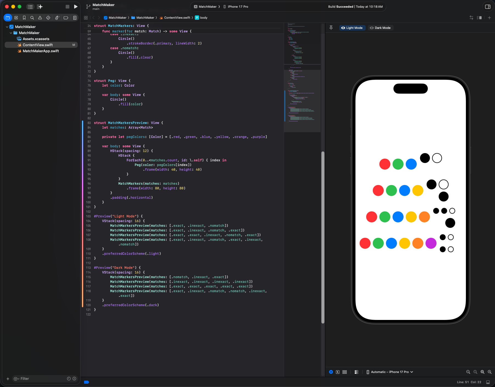

# MatchMaker

A SwiftUI implementation of the CodeBreaker game's `MatchMarkers` view from Stanford's CS193P (Spring 2025), Assignment 1.

The `MatchMarkers` view renders a square grid of feedback dots (exact / inexact / no match) that adapts to any guess length from 3 to 6 pegs. The `#Preview` shows the markers alongside colored dummy pegs in both Light and Dark Mode.

## Code Structure (top-down data flow)

```
1. Data Model      → Match enum            (the values that flow into views)
2. Atomic Views    → Peg                   (smallest reusable piece)
3. Composite View  → MatchMarkers          (consumes [Match], renders grid)
4. App Entry View  → ContentView           (uses MatchMarkers)
5. Preview Helper  → MatchMarkersPreview   (combines Peg + MatchMarkers)
6. Previews        → #Preview blocks       (drive the helper)
```

## Screenshot


